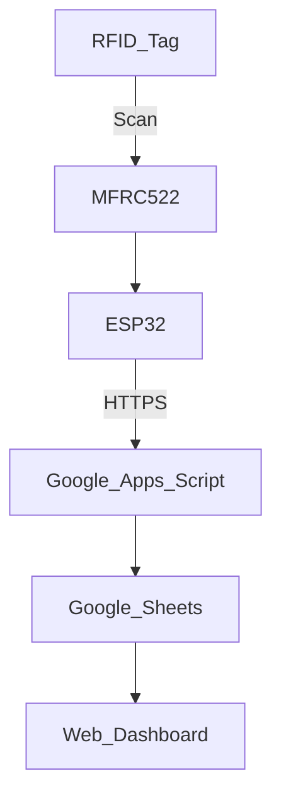
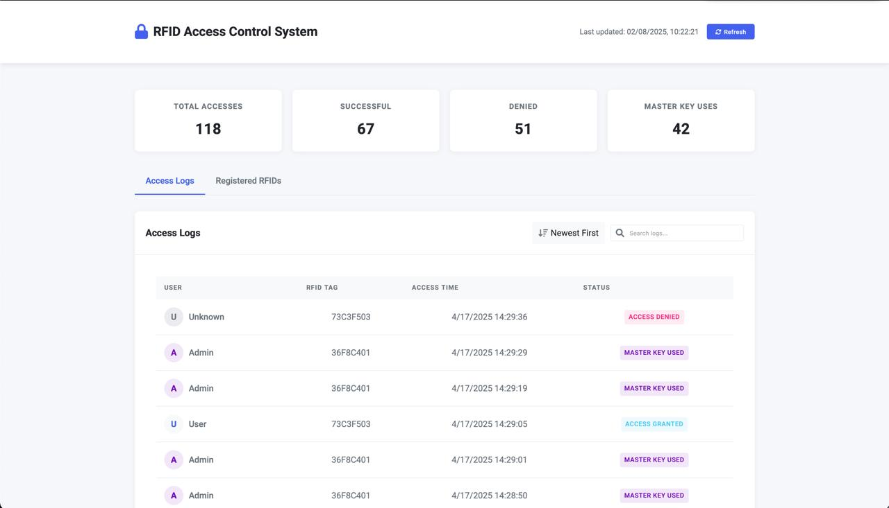

# Smart RFID Access Control System with Cloud Integration

An end-to-end smart access control system built using **ESP32** and **RFID**, with secure **cloud-based access logging** and a responsive **web dashboard** for real-time monitoring and credential management. This project combines embedded systems, web technologies, and cloud integration to demonstrate a practical IoT solution for secure authentication.

## 📚 Table of Contents

- [Features](#-features)
- [Team & Contributions](#-team--contributions)
- [Tech Stack](#-tech-stack)
- [Getting Started](#️-getting-started)
- [Key Implementation Details](#-key-implementation-details)
- [System Overview](#️-system-overview)
- [Dashboard Preview](#-dashboard-preview)
- [Future Enhancements](#-future-enhancements)

---

## 🚀 Features

- 🔐 Contactless RFID-based authentication
- 📡 Real-time access logging via Google Sheets API
- 💡 Visual and audio access feedback (LEDs + buzzer)
- 🌐 Web-based dashboard with live logs and analytics
- 💾 EEPROM storage for offline reliability
- 🔐 HTTPS + API-key protected data sync

---

## 👥 Team & Contributions

### **Josithaa Joseph**

- Developed and debugged ESP32 firmware in C++ using Arduino framework
- Integrated MFRC522 RFID module for contactless scanning
- Managed hardware setup and troubleshooting across different power modes
- Collaborated on cloud connectivity testing and local fallback logic

### **Lakshmi Sarupa Venkadesh**

- Co-developed firmware for ESP32 with RFID scanning logic
- Calibrated hardware components (reader, buzzer, LEDs) for system feedback
- Assisted in validating data transmission and edge-to-cloud sync
- Conducted comprehensive testing to ensure system stability and response speed

### **Abimanyu Jayaganesh**

- Built Google Apps Script backend for data ingestion
- Designed Google Sheets API pipeline for real-time access logging
- Developed the web dashboard (HTML, CSS, JS, Chart.js) for user insights
- Implemented secure API communication and user credential management

---

## 🛠 Tech Stack

- **ESP32 (Arduino C++)**
- **MFRC522 RFID Reader**
- **Google Sheets API + Apps Script**
- **HTML5 / CSS3 / JavaScript**
- **Chart.js (for visualization)**

---

## 🛠️ Getting Started

### 🔧 Prerequisites

- Arduino IDE with ESP32 board support installed
- Libraries: MFRC522, WiFiClientSecure, HTTPClient
- Google Apps Script endpoint set up for logging
- A Google Sheet linked with correct headers (UID, Name, Access, Last Scanned)

### 🚀 Setup Instructions

1. Clone or download this repository.
2. Open the ESP32 code in Arduino IDE.
3. Install the necessary libraries listed above.
4. Update the code with your Wi-Fi credentials and Google Apps Script URL.
5. Connect your MFRC522 and peripherals to the ESP32 as described in the circuit.
6. Upload the code and scan an RFID tag to test.

## 🧪 Key Implementation Details

- ⚡ Fast Response Time: Authentication decisions made in under 2 seconds
- 💾 Offline Capability: EEPROM stores up to 20 UIDs to support access without internet
- 🔐 Secure Sync: HTTPS + API key used for secure Google Sheets integration
- 📊 Live Monitoring: Web dashboard auto-refreshes every 30 seconds with new access data
- 🛠 Master Card Control: Admin card allows adding/removing users locally
- 🚫 Anti-Replay Protection: Implements scan cooldown to prevent repeated rapid reads

## 🖥️ System Overview

## 📸 Dashboard Preview

Below is a preview of the live web dashboard used for monitoring access logs in real-time:

## 🧠 Future Enhancements

- 🔑 Role-based access control (e.g., admin vs. user UIDs)
- 🕒 Time-based entry restrictions
- 🧲 Integration with electronic door locks
- 📱 Mobile app for on-the-go access management
- 🧠 Advanced analytics (e.g., peak access hours, entry trends)
- 🔔 Email/SMS alerts for unauthorized access attempts
